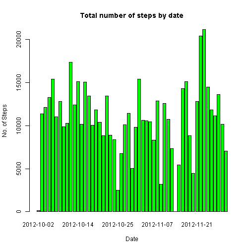
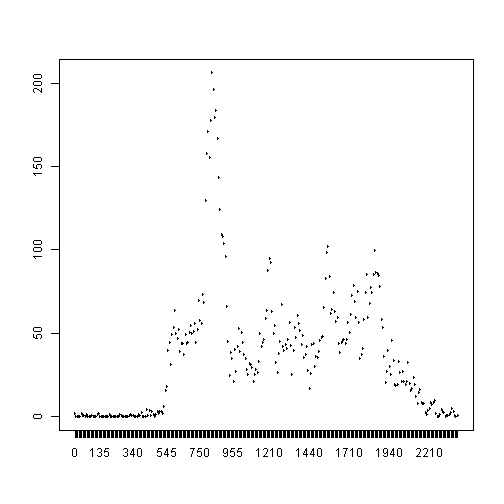
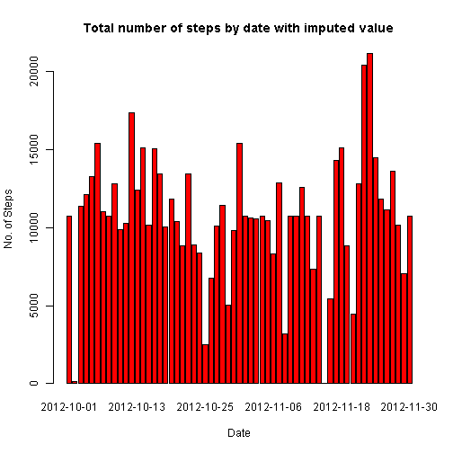
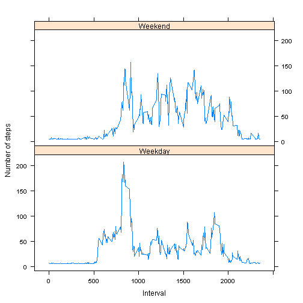

## Loading and preprocessing the data


```r
setwd("/Users/ranata/RepData_PeerAssessment1/")
act <- read.csv("activity.csv", na.string="NA")
```
## What is mean total number of steps taken per day?


```r
totDlAct <- aggregate(steps ~ date, act, sum, na.rm=TRUE)
totDlAct <- transform(totDlAct, date = factor(date))

barplot(names.arg = totDlAct$date,  
         height = totDlAct$steps, col=c("green"), 
         xlab="Date", ylab="No. of Steps",  
         main="Total number of steps by date") 
```

 

```r
meanDlAct <- aggregate(steps ~ date, act, mean, na.rm=TRUE)
medianDlAct <- aggregate(steps ~ date, act, median, na.rm=TRUE)
```


## What is the average daily activity pattern?


```r
meanIntAct <- aggregate(steps ~ interval, act, mean, na.rm=TRUE)
meanIntAct <- transform(meanIntAct, interval = factor(interval))

plot(meanIntAct$interval, meanIntAct$steps, type="l")
```

 

```r
subset(meanIntAct, steps == max(steps))$interval
```

```
## [1] 835
## 288 Levels: 0 5 10 15 20 25 30 35 40 45 50 55 100 105 110 115 120 ... 2355
```

## Imputing missing values


```r
# Calculate number of missing values
summary(act$steps)
```

```
##    Min. 1st Qu.  Median    Mean 3rd Qu.    Max.    NA's 
##    0.00    0.00    0.00   37.38   12.00  806.00    2304
```

```r
# impute missing values with mean for the corresponding 5 min interval
library(Hmisc)
```

```
## Warning: package 'Hmisc' was built under R version 3.1.2
```

```
## Loading required package: grid
## Loading required package: lattice
## Loading required package: survival
## Loading required package: splines
## Loading required package: Formula
```

```
## Warning: package 'Formula' was built under R version 3.1.2
```

```
## 
## Attaching package: 'Hmisc'
## 
## The following objects are masked from 'package:base':
## 
##     format.pval, round.POSIXt, trunc.POSIXt, units
```

```r
actImp <- act
actImp$steps <- with(actImp, impute(steps, mean))

totDlActImp <- aggregate(steps ~ date, actImp, sum, na.rm=TRUE)
totDlActImp <- transform(totDlActImp, date = factor(date))

barplot(names.arg = totDlActImp$date,  
         height = totDlActImp$steps, col=c("red"), 
         xlab="Date", ylab="No. of Steps",  
         main="Total number of steps by date with imputed value") 
```

 

```r
meanDlActImp <- aggregate(steps ~ date, actImp, mean)
medianDlActImp <- aggregate(steps ~ date, actImp, median)
```


## Are there differences in activity patterns between weekdays and weekends?


```r
actImp$date <- as.Date(actImp$date,"%Y-%m-%d")
days <- weekdays(actImp$date)
actImp$dayType <- ifelse(days == "Saturday" | days == "Sunday", 
                                "Weekend", "Weekday")
meanSteps <- aggregate(actImp$steps,
                                    by=list(actImp$interval,
                                            actImp$dayType), mean)
names(meanSteps) <- c("interval","dayType","steps")
xyplot(steps~interval | dayType, meanSteps,type="l",
       layout=c(1,2),xlab="Interval",ylab = "Number of steps")
```

 

```r
tapply(meanSteps$steps, meanSteps$dayType,
       function (x) { c(MINIMUM=min(x),MEAN=mean(x),
                        MEDIAN=median(x),MAXIMUM=max(x))})
```

```
## $Weekday
##    MINIMUM       MEAN     MEDIAN    MAXIMUM 
##   4.984347  35.610581  25.762124 207.873235 
## 
## $Weekend
##    MINIMUM       MEAN     MEDIAN    MAXIMUM 
##   4.672825  42.366401  32.704075 157.797825
```
